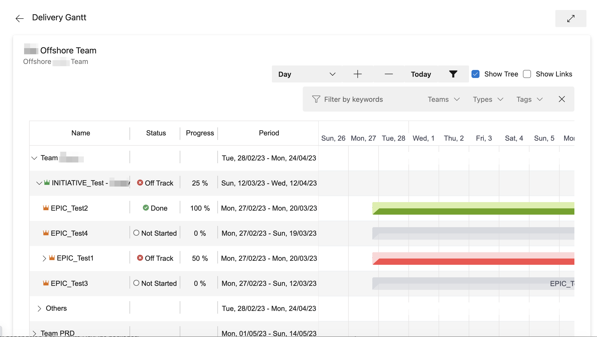
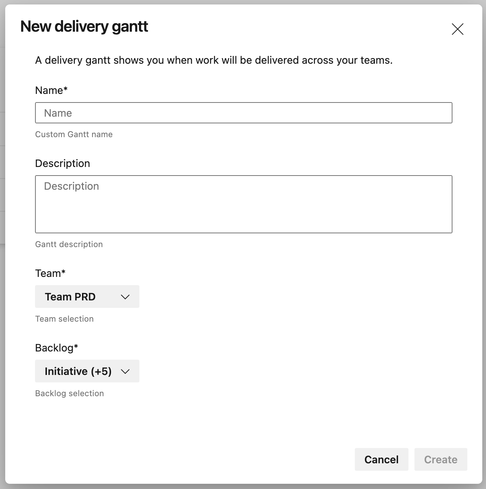
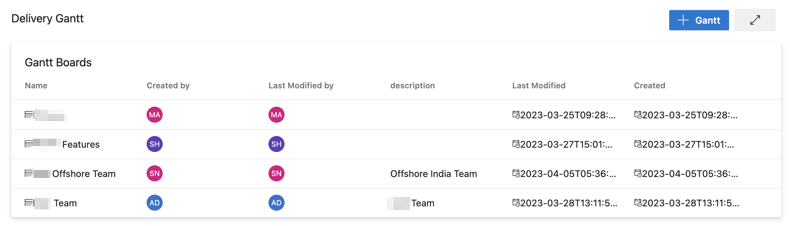
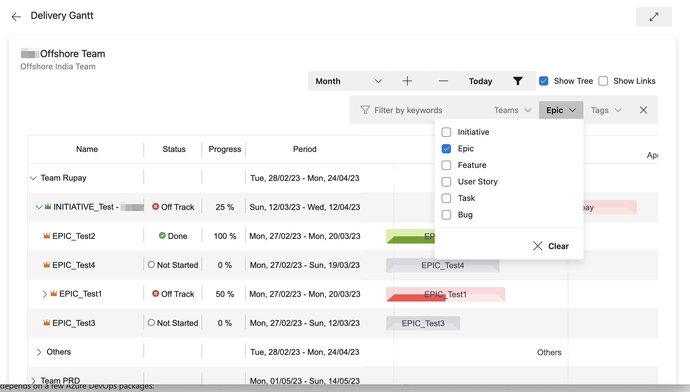

# ADO Gantt Chart Plugin

Unleash the power of visual project management with the ADO Gantt Chart plugin! This cutting-edge tool will revolutionize your experience on Azure DevOps, providing unparalleled clarity and control over your team's progress through an intuitive and interactive Gantt chart.

## Exciting Features

- **Hierarchical Gantt chart**: See your project like never before! The plugin displays your tasks in a dynamic, hierarchical Gantt chart, breaking them down into Epics, Features, and Stories. It's not just a chart; it's a comprehensive visual story of your project!

- **Custom multi-chart configuration**: Take the driver's seat and customize your Gantt charts! With the custom multi-chart configuration, you can manage multiple charts, each reflecting a unique facet of your project. It's like having multiple control rooms at your disposal!

- **Multi-team and multi-project configurations**: Multiply your management efficiency by tracking multiple teams and projects simultaneously! The plugin supports multiple teams and projects, transforming the complex maze of project tracking into a smooth, streamlined process.

- **Automatic delays identification**: Say goodbye to hidden delays! The plugin identifies delays and automatically changes the color of the Gantt bars, giving you real-time updates. It's like having your own personal project sentinel!

- **Automatic tasks hierarchy**: Experience the convenience of automatic hierarchy! This feature updates directly from your ADO tasks list, ensuring your Gantt chart always reflects the latest project structure. No need to waste time manually updating your chart – the plugin does it all!

## Transform Your Project Management Today!

Get onboard with the ADO Gantt Chart plugin today and witness a spectacular transformation in your project management. Whether it's simplifying tracking for the Program Increment, individual stories progress, or multiple projects in the program, this tool does it all. No more grappling with multiple tools and interfaces; with the ADO Gantt Chart plugin, you get a single, unified view of your project universe.

## Contributing

This project welcomes contributions and suggestions. For details, visit [ado-delivery-gantt](https://github.com/epam/ado-delivery-gantt.git).

---
